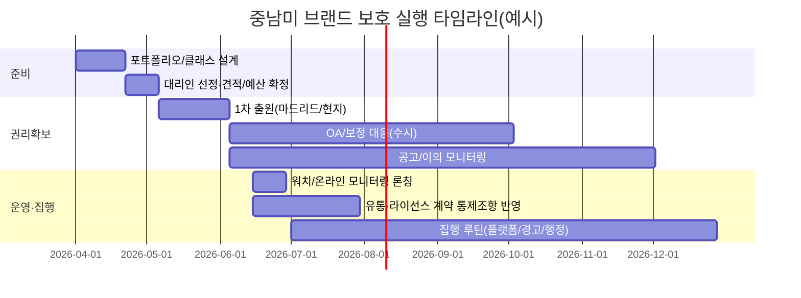

# 한국기업을 위한 중남미 브랜드 보호 전략

## Executive summary

중남미(중남미·카리브 일부 포함) 주요국은 대체로 **선출원(First-to-file) 중심**으로 권리 형성이 이루어지며, 출원·공고·이의·등록·갱신의 “형식은 유사하지만”, **① 마드리드(국제출원) 활용 가능 여부, ② 사용(Use) 요건(사용선언/불사용취소) 강도, ③ 행정구제(무효·취소)와 사법구제(침해소송) 간 분업 구조, ④ 관세·통관(국경조치) 실효성, ⑤ 온라인 마켓플레이스 집행(특히 Mercado Libre) 난이도**에서 실무 격차가 큽니다. citeturn30view0turn31view0turn28view0turn12view0turn33search4turn33search8

한국 중소·중견기업 관점의 핵심 결론은 다음과 같습니다.

첫째, **브라질·멕시코·콜롬비아·칠레는 마드리드 프로토콜 체약국**이므로 “속도/국가 커버리지/관리 효율”을 따져 **마드리드+현지 직접출원(하이브리드)**가 전략적으로 유효합니다. 반면 **아르헨티나·페루·우루과이·파나마는(본 보고서 범위 내) 마드리드 프로토콜 비가입**이어서 핵심 시장에서는 원칙적으로 **현지 직접출원**이 전제됩니다. citeturn30view0turn31view0turn29search12turn29search1turn29search3

둘째, “등록만”으로 끝나지 않습니다. 멕시코는 **등록 후 사용선언(Declaration of use)·갱신 시 사용 관련 절차**가 제도적으로 강조되고(비용도 별도), 안데스 공동체 체계(콜롬비아·페루)는 **불사용 취소(평균 3년 미사용이 핵심 트리거로 운영되는 경우가 많음)**가 실무 리스크를 좌우합니다. citeturn28view0turn11view2turn34search3turn12view0turn0search2

셋째, 최근 판례·결정 흐름은 “브랜드 유명세만으로 만능 보호”가 어렵다는 점을 반복 확인합니다. 예컨대 브라질에서는 “고명성(alto renome) 인정”이 없는 상태에서 동일·유사 표지의 타 분야 등록을 곧바로 배제하기 어렵다는 취지의 판단이 공개되어 있고, 멕시코에서는 **부적법·위법 등록의 무효 가능성과 절차적 보장**이 쟁점이 되는 사건들이 대법원(SCJN) 단계에서 다뤄졌습니다. 칠레는 지재 전문법원(TDPI)·대법원 라인에서 **식별력·혼동 가능성·공서양속 등 등록요건**이 꾸준히 쟁점화됩니다. 콜롬비아는 불사용 취소의 증명(실사용·명성 주장)과 행정결정의 사법심사가 반복됩니다. citeturn34search8turn34search1turn34search14turn34search2turn34search3

넷째, 실행 관점에서 한국기업이 즉시 적용할 “우선순위 높은 패키지”는 **(1) 상표 포트폴리오 설계(핵심표지/현지언어·음차 대응/방어출원) → (2) 출원 루트 결정(마드리드/현지) → (3) 모니터링·경고·플랫폼 집행 루틴화 → (4) 유통·라이선스 계약에 상표 통제조항 내장 → (5) 분쟁 예산·증거체계(사용증거·유통증빙) 구축**입니다. citeturn16search2turn33search1turn12view0turn28view0turn16search35

(전제) 본 보고서는 “한국 중소·중견기업 법무/해외사업 담당자”를 가정하되, **업종(소비재/의료기기/화장품/콘텐츠), 판매채널(오프라인/대리점/이커머스), 상표 수(브랜드 수·클래스 수), 분쟁 대응 강도(경고장 중심/즉시 소송)** 등이 특정되지 않았습니다. 따라서 비용·기간은 **공식 수수료(확정) + 실무상 범위(변동)**로 제시합니다. citeturn15view0turn11view0turn12view0turn33search4turn33search8

## 중남미 상표 제도 비교

### 국가별 상표 등록·갱신·분쟁 구조 비교표

아래 표는 질문에서 지정한 국가들을 중심으로 **절차(등록·이의)·심사·기간·비용·갱신·분쟁해결(행정/사법)**을 “실무 의사결정에 필요한 형태”로 압축 정리한 것입니다. (각국 법령·세칙은 수시로 개정될 수 있어, 실제 착수 전 최신 공지 확인이 필수입니다.) citeturn16search35turn33search4turn32search0turn33search0

| 국가 | 관할 상표청(주무기관) | 마드리드(국제출원) | 출원·심사·이의(핵심) | 실무상 처리기간(참고) | 공식비용(핵심 예시) | 존속·갱신·사용요건 | 분쟁해결 루트(행정·사법) |
|---|---|---|---|---|---|---|---|
| entity["country","브라질","country in south america"] | entity["organization","Instituto Nacional da Propriedade Industrial (INPI)","brazil ip office"] | 가능(2019.10 발효) citeturn30view0 | 공고 후 **이의 60일**(RPI 기준), 이의 시 신청인도 60일 내 의견 제출 가능 citeturn16search2turn16search18 | 사건·혼잡도에 따라 변동(공식 “평균치”는 사건별 상이) | (예) 1클래스 출원: 코드 389(사전승인 명세)·394(자유기재) **클래스당 수수료** 체계 citeturn15view0 / 갱신(연장): 클래스당 1,000BRL(통상) 등 citeturn15view0 | 등록 후 **첫 10년(첫 디케니오)·등록증 발급 단계가 자동·무상 처리**로 단순화(2025년 이후 운영 안내) citeturn16search35 | 행정절차(이의·무효 등) + 사법(침해·가처분) 병행. “고명성(Alto Renome)” 인정은 보호범위에 중대 영향 citeturn34search24turn34search8 |
| entity["country","멕시코","country in north america"] | entity["organization","Instituto Mexicano de la Propiedad Industrial (IMPI)","mexico ip office"] | 가능(2013.2 발효) citeturn31view0 | 출원 후 행정심사 중심(세부 절차는 기관 매뉴얼·규정에 따름). 제도적으로 **사용선언·유지관리**가 중요 citeturn28view0turn1search5 | 서면통지 “첫 응답” 기준 4개월이 제시된 서식·안내가 존재(실 전체기간은 사안별 변동) citeturn20search8 | (예) 1클래스 출원 2,695.18MXN, 갱신 2,597.77MXN, 사용선언 985.67MXN(기관·공식 자료 요약) citeturn28view0 | 존속 10년, 갱신 가능. 운영상 **사용선언(및 관련 비용)**을 일정에 포함해야 함 citeturn28view0turn1search5 | 행정(IMPI)·민사·형사·세관(국경조치) 가능(다만 국경조치는 명령·절차 요건 존재) citeturn28view0turn34search1 |
| entity["country","아르헨티나","country in south america"] | entity["organization","Instituto Nacional de la Propiedad Industrial (Argentina)","argentina ip office"] | 불가(비가입) citeturn29search12 | 출원 후 공고, **이의기간 30일(공고 기준)** 운영 안내 다수 citeturn32search5turn32search4turn32search2 | 변동(이의·서류보정 등 변수) | **2026.4.1부터 수수료 체계 개편·인덱싱(UMAPI) 도입**: 월별 IPC 연동, 포털 공지 citeturn32search0turn32search6 | 갱신·유지관리 비용이 “인덱스 연동”으로 변동(월별). 중간 사용선언(미드텀) 제도도 운영됨 citeturn2search20turn32search0 | 이의·행정절차 후 불복 시 연방법원 심사로 이어질 수 있음(기관 안내·실무 문서) citeturn32search2turn32search5 |
| entity["country","콜롬비아","country in south america"] | entity["organization","Superintendencia de Industria y Comercio (SIC)","colombia ip authority"] | 가능(2012.8 발효) citeturn30view0 | 안데스 공동체 규범(Decisión 486) 틀 내에서 등록·이의·취소 운영 citeturn0search2 | 변동(이의·취소 병행 시 장기화) | (예) 2026년 수수료: 1클래스 출원(온라인) 1,347,500COP, 갱신(온라인) 734,000COP 등 citeturn10view2turn11view0 | 불사용 취소 등 사후절차 비용이 상당(예: 불사용 취소 2,685,000COP/클래스) citeturn11view2 | 불사용 취소·무효 등 행정결정이 사법심사 대상이 되는 구조가 반복(판례 다수) citeturn34search3turn0search2 |
| entity["country","칠레","country in south america"] | entity["organization","Instituto Nacional de Propiedad Industrial (INAPI)","chile ip office"] | 가능(2022.7 발효) citeturn30view0 | INAPI 및 지재 전문심판 구조(TDPI 등)와 연동. 등록요건(식별력·혼동) 쟁점 빈번 citeturn34search2turn34search22 | 변동(이의·상소 시 장기화) | 공식 수수료는 INAPI “Derechos(수수료)” 공지에 따름 citeturn2search4 | 갱신·유지관리 체계 운영(세부는 INAPI 공지 확인) citeturn2search0turn2search4 | TDPI 사건(예: 2023년 ‘PICO’ 사건)처럼 행정거절 사유가 사법적 판단 대상 citeturn34search14turn34search2 |
| entity["country","페루","country in south america"] | entity["organization","Instituto Nacional de Defensa de la Competencia y de la Protección de la Propiedad Intelectual (INDECOPI)","peru ip office"] | 불가(비가입, 가입 논의·지원 활동 언급) citeturn29search1turn29search3 | 안데스 공동체 규범 기반(Decisión 486). 이의·무효·취소 제도 운영 citeturn0search2 | 변동 | (예, 2025.1.1 기준) 등록(상품/서비스 상표) 534.99솔, 이의 378.79솔, 갱신 240솔(오프라인), 디지털 갱신 216솔 citeturn12view0 | 불사용 취소·무효 등 절차별 수수료가 명시(예: 취소 536.64솔, 무효 585.75솔 등) citeturn12view0 | 행정절차(이의·취소·무효) 중심 + 사후 사법구제(사안별) citeturn12view0turn0search2 |
| entity["country","우루과이","country in south america"] | entity["organization","Dirección Nacional de la Propiedad Industrial (DNPI)","uruguay ip office"] | 불가(비가입) citeturn29search12 | 공고 후 이의 제도 운영(절차는 DNPI·MIEM 안내 및 수수료표 참조) citeturn33search26turn33search4 | 변동 | (예, 2026.1.1) 출원(1클래스) 7,201.20UYU(denominativa), 혼합/도형은 더 높음. 이의(1클래스) 10,081.67UYU. 갱신(1클래스) 7,201.20UYU citeturn33search4 | 존속 10년, **만료 전 6개월/만료 후 6개월(그레이스) 갱신** 안내 citeturn33search1 | DNPI 절차 + 필요 시 사법구제(침해·가처분 등) |
| entity["country","파나마","country in central america"] | entity["organization","Dirección General del Registro de la Propiedad Industrial (DIGERPI)","panama ip office"] | 불가(비가입) | 등록·수수료·갱신 요건은 법률(예: Ley 35/1996)·행정안내에 따름 citeturn33search7turn33search10 | 변동 | (예) 10년 보호 등록: MEF 104.50B/. + DIGERPI 19.20B/. / 갱신: 1클래스 134B/. 안내 citeturn33search8turn33search0 | 10년 단위 유지관리(정부 안내) citeturn33search7 | 정부 안내서에서는 **이의가 제기되면 상업법원에 대응**하는 흐름을 언급 citeturn33search10 |

**해석 포인트(실무용)**  
브라질·멕시코·콜롬비아·칠레는 마드리드 체약국이므로, “여러 국가에 동시 확장하는 한국기업”이라면 **(A) 마드리드로 1차 권리 확보 → (B) 리스크 국가(예: 위조·대리점 리스크가 큰 국가)는 현지 직접출원으로 방어층을 추가**하는 설계가 비용·속도·관리에서 균형점이 될 수 있습니다. citeturn30view0turn31view0turn28view0

## 실무 관행과 최근 5년 분쟁·판례·위조 리스크

### 분쟁 유형의 “패턴”과 국가별 촉발 요인

중남미에서 한국기업이 겪는 상표 분쟁은 통상 네 가지 축으로 수렴합니다.

첫째, **상표 브로커/스쿼팅(선점출원)**입니다. 특히 직접 진출 전(수출·온라인 판매 단계)에 브랜드가 노출되면, 현지에서 동일·유사 표지가 선출원되어 유통·플랫폼 판매가 막히는 사례가 발생합니다. 이 경우 분쟁은 “이의(opposition) 단계”에서 막지 못하면 **무효/취소(행정) + 병행침해(사법)**로 비용이 급증합니다. 다만 “유명하니 당연히 보호”가 항상 통하는 것은 아니며, 브라질의 STJ 공개 사례처럼 “고명성(alto renome) 인정 시점·요건”이 법리상 결정적일 수 있습니다. citeturn34search8turn16search2turn34search24

둘째, **불사용(Non-use) 취소/유지요건 미준수**입니다. 안데스 체계(콜롬비아·페루)에서는 불사용 취소가 구조적으로 중요한데, 콜롬비아 행정결정(SIC)을 둘러싼 사법심사 판결에서 “실사용·명성 주장 입증 실패”가 핵심 쟁점으로 나타납니다. 멕시코는 사용선언(및 관련 비용)이 별도 항목으로 존재해 “등록 후 일정 관리”가 실패하면 권리가 취약해질 수 있습니다. citeturn34search3turn11view2turn28view0turn12view0turn1search5

셋째, **식별력·혼동 가능성** 중심의 등록거절·불복 분쟁입니다. 칠레는 TDPI 및 관련 공보에서 등록 거절 사유(식별력 부족, 절차상 요건, 공서양속 등)가 지속적으로 쟁점화됩니다. 이는 “브랜드 네이밍(스페인어/포르투갈어 의미)”과 “제품·서비스 지정(클래스 및 명세)”의 품질이 분쟁 리스크를 좌우함을 의미합니다. citeturn34search2turn34search22turn34search14

넷째, **온라인·국경(통관)에서의 위조·도용**입니다. 멕시코의 공식/준공식 지침 성격 문서에서는 침해 대응이 **합의(협상)·행정·민사·형사·세관**으로 다층화되어 있음을 명시합니다. 즉 “법적 루트는 존재”하지만, 한국기업 입장에서는 **증거 수집→신속 차단(플랫폼)→확장 집행(세관/수사)→핵심 분쟁(행정/소송)** 순서로 비용 대비 효과가 큰 단계적 집행 설계를 해야 합니다. citeturn28view0turn24search21

### 최근 5년 중심의 대표 판례·결정 포인트

아래는 “실무 메시지를 주는” 공개 사례(또는 판결·결정 요지)입니다. (개별 사건의 사실관계는 각국 문서 원문 확인이 필요하며, 본 보고서는 실무 포인트 중심으로 요약합니다.)

브라질에서는 **‘고명성(Alto Renome)’ 인정의 시점·효과가 보호범위를 좌우**한다는 취지의 STJ 보도가 공개되어 있습니다. 해당 보도는 식품 분야 ‘Perdigão’ 표지가 신발 분야 동일 표지 등록을 곧바로 배제하지 못하고, INPI가 재검토할 필요가 있다는 취지의 내용을 담고 있습니다. “유명세=전 업종 독점”이 아니라, 제도상 고명성 인정과 요건 충족이 매우 중요하다는 실무 교훈을 줍니다. citeturn34search8turn34search24

멕시코에서는 대법원(SCJN) 단계의 판결문(engrose)에서 **‘잘 알려진 상표’·‘악의(mala fe)’·무효 판단의 적용 범위** 등이 논의됩니다. 즉, 등록 후에도 “행정기관의 위법·오인”이 문제 되는 경우 절차적 통제(무효)가 가능한지, 그리고 그 과정에서 당사자 방어권이 어떻게 보장되는지가 쟁점이 됩니다. “선등록을 확보해도, 분쟁이 생기면 실체·절차 모두를 준비해야 한다”는 신호입니다. citeturn34search1turn34search37

칠레에서는 WIPO Lex에 수록된 TDPI 판결(예: 2023년 ‘PICO’ 사건)처럼, INAPI의 행정거절(선량한 풍속·공서 등 포함)이 사법적 판단 대상이 됩니다. 또한 TDPI가 발간하는 상표 판례 공보에서는 **이의 판단, 클래스·상품서비스 관련성, 문언·외관 유사성**이 반복적으로 다뤄집니다. 한국기업은 “현지 언어에서의 의미·발음·연상”을 설계 단계에서 반영해야 합니다. citeturn34search14turn34search22turn34search2

콜롬비아에서는 불사용 취소가 실제로 등록에 영향을 미치며, “실사용·명성(notoria) 주장”의 증명 실패가 결과를 좌우할 수 있음을 보여주는 판결문이 공개되어 있습니다(예: ‘GRUPO EMPRESARIAL BAVARIA’ 사건). 즉, 라틴아메리카에서 상표권은 “등록+사용증거(인보이스, 라벨, 유통계약, 광고, 통관서류)”의 결합으로 안전해집니다. citeturn34search3turn0search2

### 위조·도용 리스크 요인 체크

실무적으로 위조·도용 리스크는 “국가 자체”보다 **산업·채널·가격대·공급망 가시성**에 의해 증폭됩니다. 다만 아래 요인은 중남미 공통의 고위험 패턴으로 관리할 가치가 큽니다.

- 공식 대리점/유통사 선정 전 브랜드가 선노출(온라인 판매, 전시회, SNS)되면 선점출원·도메인/마켓플레이스 계정 선점이 쉬워집니다. (특히 이 단계에서 “권리증빙이 약하면” 플랫폼 집행 속도가 느려질 수 있습니다.) citeturn28view0turn33search10turn16search18  
- “등록은 했지만 사용증거가 약한” 경우: 불사용 취소·갱신/사용선언 단계에서 취약해질 수 있습니다. citeturn12view0turn11view2turn1search5turn33search1  
- 상표 명세(상품·서비스 지정) 품질이 낮으면: 거절/이의/불복에서 불리합니다(칠레 공보·판례에서 반복). citeturn34search22turn34search2turn34search14  

## 한국기업 브랜드 보호 전략

### 사전 전략

사전 전략의 목표는 “진출 전에 권리 기반을 깔고, 진출 후 집행 비용을 낮추는 것”입니다.

첫째, **포트폴리오 설계(무엇을 어떤 범위로 보호할지)**부터 표준화해야 합니다. 실무상 ‘핵심표지’는 (a) 워드마크(한글/영문), (b) 로고, (c) 슬로건, (d) 제품 라인명(서브브랜드)로 묶이며, 중남미에서는 특히 **스페인어·포르투갈어 의미/발음**을 반영해 “혼동 리스크가 낮은 네이밍”을 설계하는 것이 분쟁비용을 크게 줄입니다. (칠레·브라질의 등록요건/이의 구조는 이런 설계의 중요성을 강화합니다.) citeturn34search2turn16search2turn34search22

둘째, **출원 루트(우선권·마드리드·현지 직접출원)를 제품·국가별로 나누는 하이브리드**가 효과적입니다.  
- 브라질·멕시코·콜롬비아·칠레: 마드리드 활용 가능(체약국). “여러 국가 동시 진출·관리 효율”이 목표라면 마드리드가 강점입니다. citeturn30view0turn31view0  
- 아르헨티나·페루·우루과이·파나마: 마드리드 비가입(본 범위 기준) → 직접출원 중심 설계가 현실적입니다. citeturn29search12turn29search1turn29search3  

셋째, **공식 수수료 구조를 전제로 국가별 “1클래스 최소 권리 확보”를 먼저 하고, 후속 확장을 옵션화**하는 방식이 중소·중견기업에 적합합니다. 예를 들어 우루과이는 2026년 수수료표 기준으로 “워드마크(denominativa) 1클래스”와 “혼합/도형(미xta)”의 수수료가 차등이며, 이의·갱신도 계층형 비용입니다. 브라질도 출원 유형(사전승인 명세/자유기재)별로 수수료가 다릅니다. 이 구조를 이용해 **초기에는 핵심 클래스에 워드 중심으로 확보 → 2차로 로고/추가 클래스 확장**이 비용 효율적일 수 있습니다. citeturn33search4turn15view0turn16search35

넷째, **계약(유통·OEM·라이선스) 설계로 ‘상표 통제권’을 선제 확보**해야 합니다. 중남미에서 흔한 리스크는 “대리점이 상표를 자기 명의로 출원”하거나 “현지 파트너가 온라인 계정을 선점”하는 유형입니다. 계약에 다음을 최소로 넣는 것이 실무적으로 유효합니다: (1) 선출원 금지·권리 귀속, (2) 상표·로고 사용 가이드/승인권, (3) 온라인 판매 채널·계정 권한, (4) 위조 발견 시 통지·협력 의무, (5) 계약 종료 시 즉시 사용 중단·재고 처리 규정.

### 사후 전략

사후 전략은 (1) 조기경보, (2) 저비용 차단, (3) 확장 집행, (4) 소송/행정심판의 순서로 설계할수록 비용 대비 효과가 높습니다. 이는 멕시코 자료가 제시하는 “합의→행정→민사/형사/세관” 다층 구조와도 정합적입니다. citeturn28view0

핵심은 **모니터링 체계**입니다. 권리 확보 후에는 최소 다음을 루틴화하는 것이 권장됩니다.
- 상표 공보/출원 모니터링(이의 기간 내 대응 전제): 브라질은 RPI 공고일을 기준으로 법정기간이 기산된다는 점이 강조됩니다. citeturn16search18turn16search2  
- 갱신·사용요건 캘린더화: 멕시코는 사용선언 비용·절차가 별도 항목으로 존재하며, 우루과이는 만료 전후 6개월 창(그레이스) 등 일정 규칙이 안내됩니다. citeturn28view0turn1search5turn33search1  
- 온라인 마켓플레이스·SNS·도메인 감시: “등록증/출원번호”를 증빙해 빠르게 차단할 수 있도록 증거 패키지를 준비(상표등록증, 라이선스/대리점 계약, 정품 식별 포인트, 비교 이미지, 구매테스트 등)

## 현지 대리인·법률서비스 옵션과 예산

### 서비스 옵션 비교표

중남미에서는 “현지 대리인”이 사실상 프로젝트 매니저(PM) 역할을 수행하는 경우가 많습니다. 아래는 한국기업이 실제로 선택하는 서비스 조합을 **범주형**으로 비교한 표입니다. (특정 로펌/벤더 추천은 기업 상황과 이해상충 이슈가 있어, 본 보고서는 **선정 기준과 비용대역** 중심으로 제시합니다.)

| 옵션 | 서비스 범위 | 장점 | 리스크/한계 | 대략 비용대역(USD, 변동) | 추천 기준 |
|---|---|---|---|---|---|
| 현지 상표 부티크(국가별) | 출원·OA 대응·이의/취소·경고장·단순 소송 | 단가 경쟁력, 현지 실무 감각 | 다국가 PM 부담(한국 본사가 조율) | 출원 대리 수임료(1클래스) 수백~1,500+ / 이의·취소 수천~ | 1~2개국 집중, 분쟁 빈도 낮음 |
| 지역(라틴) 허브형 로펌 | 다국가 포트폴리오 관리, 표준 리포팅 | 한국 본사 커뮤니케이션 단순화 | 단가 상승, 하청 구조 가능 | 연간 관리비+사건별 | 4개국 이상 동시 운영 |
| 글로벌 네트워크 로펌 | 거래/투자/분쟁 통합(상표+계약+컴플라이언스) | 크로스보더 분쟁 대응 | 비용 가장 큼 | 분쟁은 수만~ | M&A/대형 분쟁 가능성 높음 |
| 감시(워치) 전문 + 법률 대리 | 워치 리포트 + 법률조치 분리 | 고정비 통제 | 커뮤니케이션 이원화 | 워치 월/분기 과금 + 사건비 | 온라인 위조·출원 남발 업종 |
| 플랫폼 집행(브랜드 보호) 전문 | 마켓플레이스 신고·증거 패키지·반복 침해자 관리 | 속도, 운영 부담 경감 | 법적 강제력 한계 | 월정액 또는 건당 | Mercado Libre 등 비중 큼 |

### 단계별 예상 예산(공식수수료 + 실무 비용)

아래는 “대표적 8개국 동시 진출”을 가정한 **단계별 예산 프레임**입니다. 공식 수수료는 각국 공지(또는 공신력 있는 기관 요약) 기반이고, 대리인 수임료·번역·공증 등은 변동성이 커 범위로 제시합니다. citeturn15view0turn11view0turn12view0turn33search4turn33search8turn28view0turn32search0

| 단계 | 산출물 | 비용 구성 | 예산 가이드(USD) |
|---|---|---|---|
| 사전 진단(2~4주) | 클래스 맵, 충돌 검색, 네이밍 리스크 리포트, 출원 우선순위 | 내부 공수 + 각국 선행검색(선택) + 자문 | 3,000 ~ 20,000 |
| 1차 권리 확보(3~12개월) | 핵심 상표(워드 1~2개, 핵심 클래스) 출원·OA 대응 | **공식수수료(국가별)** + 대리인 수임료(국가별) + 번역/공증(필요 시) | 15,000 ~ 80,000 (국가 수·클래스 수에 선형 증가) |
| 2차 확장(6~18개월) | 로고/서브브랜드/추가 클래스, 방어출원 | 동일 | 10,000 ~ 60,000 |
| 운영(연간) | 워치(출원/온라인), 갱신·사용선언 캘린더, 유통계약 감사 | 워치 수수료 + 정기 자문 | 5,000 ~ 40,000/년 |
| 분쟁(사건별) | 이의/취소/무효, 경고장, 플랫폼 차단, 민·형사 | 공식 수수료 + 변호사비 + 증거조사/구매테스트 | 5,000 ~ 150,000+ (단계·국가·상대 규모에 따라 급변) |

**국가별 “공식비용” 참고(대표 수치)**  
- 브라질: 1클래스 출원 수수료(코드 389/394)·이의(332)·갱신(374/375) 등이 INPI 수수료표에 코드별로 명시. citeturn15view0  
- 콜롬비아: 2026년 기준 1클래스 출원(온라인 1,347,500COP), 갱신(온라인 734,000COP), 불사용취소(2,685,000COP) 등. citeturn10view2turn11view0turn11view2  
- 페루: 2025.1.1 기준 등록 534.99솔, 이의 378.79솔, 갱신 240솔/디지털 216솔 등. citeturn12view0  
- 우루과이: 2026.1.1 기준 출원(워드 1클래스 7,201.20UYU), 이의(1클래스 10,081.67UYU), 갱신(워드 1클래스 7,201.20UYU) 등. citeturn33search4  
- 파나마: 10년 보호 등록(예: MEF 104.50B/. + DIGERPI 19.20B/.) 및 갱신(1클래스 134B/.) 등의 안내. citeturn33search8turn33search0  
- 멕시코: 공신력 있는 기관 요약 자료에서 1클래스 출원(2,695.18MXN), 갱신(2,597.77MXN), 사용선언(985.67MXN) 등 제시. citeturn28view0  
- 아르헨티나: 2026년부터 수수료 인덱싱(UMAPI) 도입으로 월별 변동(포털 공지). citeturn32search0turn32search6  

## 실행 로드맵과 체크리스트

### 우선순위 로드맵 표

| 단계 | 우선순위 | 타임라인(권장) | 핵심 작업 | 성공 기준(KPI) |
|---|---|---|---|---|
| 진출 전 준비 | 높음 | T-3~T-1개월 | 클래스·국가 우선순위 확정, 네이밍 검토, 대리인 선정 | “출원 국가/표지/클래스” 확정, 예산 승인 |
| 1차 출원 | 최상 | T-1~T+3개월 | (가능국) 마드리드/현지 출원 병행, 핵심 워드마크 선출원 | 핵심 8개국 출원 완료, OA(거절이유) 대응 체계 확보 |
| 공고·이의 대응 | 최상 | T+2~T+8개월 | 이의 모니터링, 조기 합의(가능 시), 증거 패키지 구축 | 이의율/거절율 관리, 주요국(브·멕·콜·칠) 이의 대응 SLA |
| 상표 운영체계 구축 | 높음 | T+3~T+12개월 | 워치·온라인 모니터링, 사용증거 저장소, 갱신/사용선언 캘린더 | “사용증거” 분기별 업데이트, 일정 준수 100% |
| 집행(Enforcement) | 중~높음 | 상시 | 경고장, 플랫폼 차단, 재범 추적, 필요 시 취소/침해소송 | 반복 침해자 감소, 위조 리스팅 제거 리드타임 단축 |
| 확장·최적화 | 중간 | T+6~T+18개월 | 추가 클래스/로고/서브브랜드 확장, 방어출원 | 매출 상위 SKU/채널 커버율 90%+ |

### 구현 타임라인(mermaid)



### 집행(Enforcement) 플로우(mermaid)

```mermaid
flowchart TD
    A[모니터링: 출원/온라인/세관] --> B{침해 의심?}
    B -- 아니오 --> A
    B -- 예 --> C[증거수집: 캡처·구매테스트·유통증빙]
    C --> D{권리 상태}
    D -- 출원중/등록전 --> E[이의/의견서·우선권 정리]
    D -- 등록완료 --> F[경고장/협상(단기 차단)]
    F --> G{상대가 중단?}
    G -- 예 --> A
    G -- 아니오 --> H[플랫폼 집행: 리스팅/계정 차단]
    H --> I{재범/조직적 위조?}
    I -- 아니오 --> A
    I -- 예 --> J[행정절차: 취소/무효/침해신고]
    J --> K[사법: 가처분·침해소송/형사(가능국)]
    K --> A
```

### 체크리스트(현장용)

- **권리 설계**
  - 핵심표지(워드/로고/슬로건) 확정
  - 클래스(현재 제품 + 12~24개월 확장 제품) 맵 작성
  - 현지 언어(스페인어/포르투갈어)에서 부정적 의미·기술적/서술적 의미 점검  
- **출원 실행**
  - 마드리드 가능국/불가능국 분리(국가별 루트 문서화) citeturn30view0turn29search12
  - 공증·위임장·번역 필요 여부 국가별 확인
- **운영**
  - 갱신/사용선언 캘린더(멕시코·우루과이 등) 구축 citeturn1search5turn33search1
  - 사용증거 저장소(인보이스·통관·광고·패키징) 분기 업데이트
- **집행**
  - 경고장 템플릿(스페인어/포르투갈어)·증거 패키지 표준화
  - 재범자 “블랙리스트” 및 플랫폼 신고 이력 관리

## 운영 유의점과 우선순위 권고안

### 문화·언어·관습·통관·온라인 마켓플레이스 실무 포인트

중남미 실무에서 “법률”만큼 중요한 것이 **언어·관행·유통·통관**입니다.

언어 측면에서 스페인어권과 포르투갈어권은 동일 알파벳을 쓰더라도 발음·연상·상표의 ‘지배적 부분’ 판단이 달라질 수 있어, 칠레의 판례/공보 흐름처럼 **식별력·혼동 판단**이 촘촘한 국가에서는 네이밍의 미세 차이가 결과를 갈라놓습니다. citeturn34search22turn34search14turn34search2

통관·관세 측면에서는 국가별로 “상표권을 근거로 한 국경조치”가 가능하더라도, 멕시코 요약자료가 지적하듯 통상 **행정기관(IMPI) 또는 검찰(수사) 명령 등 절차 요건**이 붙습니다. 따라서 한국기업은 “세관에서 알아서 막아주겠지”가 아니라, **정품 식별 매뉴얼·권리증빙·현지 연락체계**를 세관·조사기관과 연동시키는 방식으로 접근해야 합니다. citeturn28view0

온라인 마켓플레이스는 라틴아메리카에서 유통·위조의 핵심 전장입니다. entity["company","Mercado Libre","latin america ecommerce"] 같은 역내 대형 플랫폼을 활용하는 경우, 법적 절차(소송)보다 먼저 **플랫폼 집행(신고→차단→재범 관리)**이 비용 대비 효과가 큰 경우가 많습니다. (플랫폼 정책·프로그램은 수시 변경되므로, 공식 안내 최신본 기준으로 워크플로우를 고정해야 합니다.) citeturn0search3turn28view0

image_group{"layout":"carousel","aspect_ratio":"16:9","query":["Mercado Libre logo","Mercado Libre marketplace Latin America","Latin America customs counterfeit seizure","trademark registration office Latin America"],"num_per_query":1}

### 권고사항별 기대효과·리스크·비용·우선순위 표

| 권고안 | 기대효과 | 미이행 리스크 | 비용/난이도 | 우선순위 |
|---|---|---|---|---|
| 핵심 8개국 ‘워드마크 1클래스’ 선출원(가능국은 마드리드 병행) | 선점출원·플랫폼 차단 리스크 크게 감소 | 대리점·제3자 선점출원 시 회수 비용 급증 | 중 | 최상 |
| 멕시코 ‘사용선언’ 및 안데스권 ‘불사용 취소’ 대비 캘린더+증거저장소 | 등록 후 권리 안정성 확보 | 사용증거 부재로 취소/무효에 취약 | 중 | 최상 citeturn1search5turn12view0turn34search3turn28view0 |
| 브라질 ‘고명성(Alto Renome)·유명상표’ 전략 검토(필요기업 한정) | 타 클래스·타 업종 확장 억제력 강화 가능 | 유명세만 믿고 방치 시 타 업종 등록 허용될 수 있음 | 높음 | 업종/브랜드 규모에 따라 상~중 citeturn34search8turn34search24 |
| 우루과이·파나마 등 비(非)마드리드국은 “직접출원+현지 대리인” 표준화 | 사각지대 최소화 | 커버리지 누락(시장 진입 후 뒤늦은 분쟁) | 중 | 높음 citeturn33search4turn33search8turn29search12 |
| 워치(출원 감시)+온라인 모니터링을 하나의 운영 KPI로 통합 | 이의기간 내 선제 차단 | 이의기간 경과 후 비용 폭증 | 중 | 최상 |
| 유통·라이선스 계약에 상표 통제조항(계정·도메인 포함) 의무화 | 파트너 리스크 억제 | 내부자(파트너) 분쟁이 가장 비싸고 오래 감 | 낮~중 | 최상 |
| 집행은 “플랫폼→경고→행정→소송” 단계 설계 | 비용 대비 효과 극대화 | 즉시 소송은 비용·시간 부담 | 중 | 높음 citeturn28view0turn33search10 |

**핵심 메시지:** 중남미는 “등록 제도” 자체보다, **국가별 유지요건·이의기간·분쟁 루트**와 **유통/온라인 집행 실무**가 브랜드 보호 성패를 가릅니다. 위 표의 최상위 항목(선출원·캘린더·증거·계약 통제·모니터링)을 먼저 표준화하면, 이후 분쟁이 생겨도 “선택지”가 늘어납니다. citeturn16search2turn33search1turn28view0turn34search3turn33search4