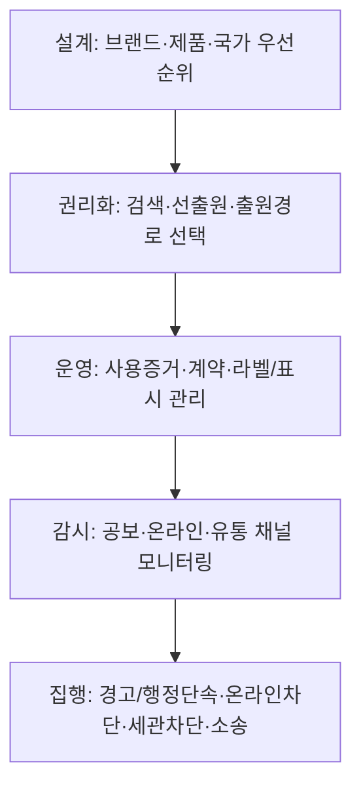

# 서문: 중남미 브랜드 보호 리스크 맵

## 핵심 요약

중남미는 한 덩어리 시장처럼 보이지만, 실제로는 언어(스페인어권·포르투갈어권), 경제권(메르코수르·태평양동맹 등), 물류축(허브 국가)에 따라 브랜드 리스크가 달라지는 “클러스터 시장”입니다. citeturn12search1turn11view0turn14search5  
한국 기업이 가장 자주 겪는 문제는 “상표를 늦게 내서 생기는 일(무단선점·이름 충돌)”과 “등록 후 관리 부재(사용증거 미비·모니터링 부재·온라인 위조 확산)”로 요약됩니다. citeturn5view1turn20search7turn6search12turn3search18  
이 서문은 국가별로 복잡한 제도를 한 번에 외우기보다, 실무 관점 리스크 지도(무엇이 어디서 터지는지)를 먼저 잡아드리기 위한 ‘출발점’입니다. 특히 상표 선등록·사용증거 체계·온라인/통관 차단이 초기 비용 대비 효과가 큰 “3대 레버”입니다. citeturn0search5turn1search10turn1search14turn3search18  

## 중남미 시장 한눈에 보기

중남미는 크게 다섯 묶음으로 이해하면 편합니다: (a) 북미 공급망 연계형(entity["country","멕시코","north america country"] 중심), (b) 허브형(entity["country","파나마","central america country"]), (c) 포르투갈어 대륙형(entity["country","브라질","south america country"]), (d) 안데스 규범권(entity["organization","안데스 공동체","andean integration bloc"] 기반의 entity["country","콜롬비아","south america country"]·entity["country","페루","south america country"]·entity["country","에콰도르","south america country"]), (e) 남미 남부권(entity["country","아르헨티나","south america country"]·entity["country","칠레","south america country"]). 이 구분은 관세·유통·인허가뿐 아니라, “어디서 누구와 어떻게 계약하고 상표를 어떻게 운영할지”를 좌우합니다. citeturn12search1turn12search19turn14search5  

언어는 실무에서 ‘옵션’이 아니라 ‘비용 구조’입니다. 멕시코는 스페인어 소통 필요성을 entity["organization","대한무역투자진흥공사(KOTRA)","korea trade agency"] 자료에서 반복적으로 강조하고, 브라질은 포르투갈어가 사실상 업무 기본 언어로 작동합니다. citeturn13search5turn19search10turn19search7 이 차이는 상표 검색·출원(표장 의미/발음), 경고장·증거 수집, 온라인 플랫폼 신고까지 전 과정의 속도와 성공률에 영향을 줍니다. citeturn3search1turn3search18  

유통은 “오프라인이 크고, 온라인이 빠르게 커지는” 이중 구조가 특징입니다. 한류 연계 상품의 경우 온라인에서 먼저 바이럴되고 오프라인으로 확산되는 패턴도 관찰됩니다. citeturn7search4turn7search1 동시에 물류·통관의 마찰비용이 커서(거리·인프라·행정절차) 배송 지연이 브랜드 신뢰(AS·정품 여부)와 직접 연결되기도 합니다. 중남미 물류 성과가 선진국 대비 뒤처진다는 평가는 entity["organization","미주개발은행(IDB)","inter-american development bank"] 연구에서도 반복됩니다. citeturn11view0turn19search13  

image_group{"layout":"carousel","aspect_ratio":"16:9","query":["Latin America map countries","Mercosur Pacific Alliance map","Panama Canal aerial view","Mexico Brazil map Portuguese Spanish"],"num_per_query":1}  

## 한국기업이 자주 맞는 핵심 브랜드 리스크

상표 리스크의 출발점은 “먼저 등록한 사람이 권리를 행사하기 쉬운 구조”와 “특수관계자(딜러·배급사·대리인)의 선점”입니다. 실제로 멕시코에서는 본사가 딜러를 통해 사업을 하다가, 뒤늦게 딜러의 상표 등록을 발견하는 유형이 거론됩니다. citeturn5view1turn4view2 이때 계약서에 ‘상표등록 금지’ 조항이 있어도 분쟁을 완전히 막지 못하고, 무효/취소 절차가 길어 사업 손실로 이어질 수 있습니다. citeturn5view1  

“등록만 하면 끝”이 아니라, 사용(Use)과 사용증거(Evidence)가 두 번째 지뢰입니다. 예를 들어 멕시코는 등록 후 일정 시점(3년 경과 후 3개월 등)에 사용선언(Declaración de uso)을 요구하며, 미제출 시 권리가 소멸될 수 있음을 정부 안내문에서 명시합니다. citeturn6search12turn6search24 안데스 규범권에서는 3년 연속 불사용이 취소 사유가 되고, 사용 입증 부담이 권리자에게 있다는 점이 공공기관 자료에서 확인됩니다. citeturn20search7turn20search3 즉 “판매는 했는데, 증거가 흩어져 있다”가 치명적 약점이 됩니다.  

위조·유통 리스크는 (1) 오프라인 다단계 유통, (2) 국경을 넘는 온라인 거래, (3) 정품/병행수입/가품이 섞이는 회색지대에서 부풀어 오릅니다. 한국 기업 입장에서는 ‘짝퉁’ 자체뿐 아니라, 가품이 리뷰·평점·반품 경험을 통해 브랜드 신뢰를 깎는 2차 피해가 큽니다. citeturn7search4turn7search1turn3search18  

온라인은 이제 선택지가 아니라 “주전장”입니다. 중남미 전자상거래 시장이 빠르게 성장하고, 국가별 비중에서 브라질·멕시코 등이 큰 축을 차지한다는 분석이 공개되어 있습니다. citeturn7search1 이에 맞춰 entity["organization","한국지식재산보호원","korea ip protection agency"]은 해외 온라인 위조상품 유통 현황을 조사·보고서로 제공하는 사전진단(플랫폼 선택) 같은 지원 체계를 운영합니다. citeturn3search18turn3search7  

법적 집행과 관세(통관) 리스크는 “절차를 아는 쪽이 이기는 게임”에 가깝습니다. 멕시코 사례처럼 행정·사법 절차가 장기화될 수 있고, 비용과 시간이 사업 지속 가능성을 좌우합니다. citeturn5view1 통관 단계에서는 세관에 권리를 ‘기록’해두지 않으면 단속이 비효율적이라는 취지의 안내가 존재하며, 한국 정부는 해외 세관 지재권 등록 지원을 포함한 해외 IP센터 지원을 운영합니다. citeturn1search14turn1search10  

## 국가별 리스크 수준 매트릭스

아래 표는 “시장 규모”가 아니라, 브랜드 보호 실무 난이도(선점 가능성·사용요건·집행/통관·온라인 노출·운영복잡도)를 합산한 상대평가입니다. (동일 기업이라도 산업·유통모델에 따라 달라질 수 있습니다.) citeturn11view0turn7search1turn5view1  

| 국가 | 종합 리스크 | 왜 그렇게 보나(실무 포인트) | 초기에 특히 챙길 것 |
|---|---|---|---|
| 브라질 | 높음 | 포르투갈어권 + 불사용 취소 제도(5년 경과 후 청구 가능) + 통관/행정 복잡성 | 선출원, 대리인/유통계약에서 상표 통제, 증거관리 |
| 멕시코 | 높음 | 딜러 선점·분쟁 사례 언급 + 3년 사용선언 미제출 시 소멸 위험 + 온라인 비중 확대 | “출원+모니터링” 동시 시작, 3년 사용선언 캘린더화 |
| 콜롬비아 | 중간~높음 | 안데스 규범(3년 불사용 취소) + 행정기관 중심 운영 | 사용증거 체계(송장·광고·리셀러 자료) |
| 아르헨티나 | 중간~높음 | 5~6년차 중간 사용선언 + 갱신 시 사용선언(최근 5년 사용) | 사용선언 일정관리, 상표 포트폴리오 정리 |
| 칠레 | 중간 | 제도 예측 가능성 비교적 높다는 평가 + 불사용 취소 사유 도입 | 출원·갱신·사용증거 기본만 지켜도 효율적 |
| 페루 | 중간 | 안데스 규범(3년 불사용 취소) + 행정기관 관여 | 짧은 주기로 “사용 흔적”을 남기는 운영 |
| 에콰도르 | 중간~높음 | 안데스 규범(3년 불사용 취소) + 시장/집행 자원 제약 가능 | 핵심 표장만 우선권리화 + 유통 파트너 통제 |
| 파나마 | 중간 | 허브(운하·자유무역지대)로 유통·재유통 리스크 + 5년 불사용 취소 | 허브용 상표 방어(물류/유통법인 명의 정리), 통관 연계 |

표의 제도 근거(요지): 브라질의 불사용(카두시다지) 운영은 entity["organization","브라질 국립산업재산권청(INPI)","brazil ip office"] 안내에서 5년 구간을 기준으로 설명되고, 멕시코의 사용선언은 정부 문서에서 3년 경과 후 제출 의무 및 미제출 시 효력 상실을 명시합니다. citeturn6search2turn6search12turn6search24 콜롬비아·페루·에콰도르는 안데스 결정 486에 따른 3년 불사용 취소(입증 부담 포함) 체계가 공공기관/감독기관 자료로 확인됩니다. citeturn20search7turn20search3 아르헨티나의 중간 사용선언과 갱신 요건은 정부 안내에 정리되어 있고, 칠레는 법 개정으로 불사용 취소 사유를 도입했습니다. citeturn20search4turn20search20turn20search17 파나마는 법령(및 WIPO Lex)에 5년 불사용이 취소 사유로 규정되어 있습니다. citeturn20search14turn20search2  

## 한국기업의 대표적 실패 패턴

첫째, 딜러/배급사가 상표를 선등록하고 ‘몸값’을 요구하는 패턴입니다. 멕시코 진출 과정에서 계약서에 금지조항이 있어도 악의적 등록이 발생할 수 있고, 무효 절차가 길어(1년 이상~수년) 사업에 타격이 된다는 경고가 공개 자료에 등장합니다. 교훈은 단순합니다: *계약서로 막기 전에, 본사가 먼저 등록하고 모니터링해야 합니다.* citeturn5view1turn0search5  

둘째, 등록 후 ‘사용선언/사용증거’ 관리를 놓쳐 권리가 자동 소멸·취소되는 패턴입니다. 특히 멕시코는 사용선언을 일정 기간 내 제출해야 하며, 안데스 권역은 3년 불사용이 취소 사유가 될 수 있습니다. 교훈: *“출원 캘린더”만으로 부족하고, “사용 캘린더+증빙 폴더”가 함께 있어야* 합니다. citeturn6search12turn20search7turn20search3  

셋째, 온라인에서 가품이 먼저 ‘검색 결과’를 점령해 정품 출시/확대가 늦어지는 패턴입니다. 중남미 전자상거래가 빠르게 성장한다는 관측이 있는 만큼, 플랫폼 상의 가품은 초기부터 브랜드를 훼손할 수 있습니다. 교훈: *런칭 전부터 모니터링 키워드(브랜드명·오탈자·현지어 변형)를 정하고, 신고·차단 루틴을 표준화*해야 합니다. citeturn7search1turn3search18turn7search4  

넷째, ‘허브 국가’에서 유통이 퍼지는 문제입니다. 파나마는 운하를 중심으로 물류·유통 거점 성격이 강하고, 세계 해상무역에서 중요한 비중을 담당한다는 설명이 있습니다. 교훈: *판매국만이 아니라 허브국에도 ‘방어용 상표(핵심 클래스)’를 깔아두는 것이* 비용 대비 효과적일 수 있습니다. citeturn14search5turn20search14  

다섯째, 세관 단계에서 막을 수 있었는데, ‘권리 기록/연계’가 없어 놓치는 경우입니다. 통관단계 보호를 위해 세관신고(권리정보 공유)가 중요하다는 안내가 있고, 한국의 해외 IP센터 지원에는 해외 세관 지재권 등록 지원이 포함됩니다. 교훈: *위조 대응은 ‘사건 발생 후 소송’보다 ‘통관 차단+유통 차단’이 훨씬 싸다*는 점입니다. citeturn1search14turn1search10  

## 5단계 실행 전략과 독자용 빠른 행동 지침

이 책이 제안하는 실행 전략은 “한 번에 완벽”이 아니라, 작게 시작해 빠르게 루틴을 만드는 5단계입니다. 국제출원(마드리드)을 포함한 다국가 보호는 절차 선택이 핵심이며, entity["organization","세계지식재산기구(WIPO)","un ip agency"] 역시 국제상표 출원 절차의 단계성을 안내합니다. citeturn0search2turn6search3  

각 단계 최소 체크리스트(“이것만은”)  
설계: 핵심 표장(영문/현지어) 1~2개와 핵심 상품류를 정하고, 국가를 클러스터로 묶어 우선순위를 매깁니다. citeturn12search1turn7search1  
권리화: 선출원·선등록을 기본으로 하고, 등록 후에는 모니터링을 “본사 업무”로 둡니다(딜러 위임 금지). citeturn5view1turn0search5  
운영: 사용선언/불사용 취소에 대비해 송장·광고·온라인 판매 캡처 등 증거를 월 단위로 쌓습니다. citeturn6search12turn20search7turn6search2  
감시: 온라인 위조·모방을 조기 발견하기 위해 플랫폼 기반 점검(정기 리포트/신고 루틴)을 구축합니다. citeturn3search18turn7search1  
집행: 세관·플랫폼·행정단속을 ‘먼저’ 검토하고, 필요할 때 소송으로 확장합니다(비용·시간 역량 고려). citeturn1search14turn1search10turn5view1  

독자용 “초기 5가지 우선조치”  
(1) 8개국에서 내 브랜드가 이미 출원/등록됐는지 먼저 조회(자사·딜러·제3자 포함)하고, 발견 즉시 대응 루트를 정합니다. citeturn4view1turn3search0  
(2) 멕시코·안데스 권역·브라질·파나마에 대해 사용요건 캘린더(3년/5년/중간선언)를 만든 뒤, 분기별로 증거 폴더를 점검합니다. citeturn6search12turn20search7turn6search2turn20search4turn20search14  
(3) 유통/딜러 계약서에 상표 소유·출원 금지·라이선스 범위·종료 후 사용금지를 넣고, 실무 운영(누가 출원하고 누가 갱신하는지)을 RACI로 고정합니다. citeturn5view1  
(4) 주요 온라인 채널에 대해 브랜드명·오탈자·현지어 변형 키워드로 월 1회 모니터링을 시작하고, 신고 템플릿(증빙 포함)을 마련합니다. citeturn3search18turn7search1  
(5) 판매국·허브국에서 세관 차단 가능성(권리 등록/연계)을 점검하고, 필요 시 해외 IP센터 지원을 검토합니다. citeturn1search14turn1search10turn14search5