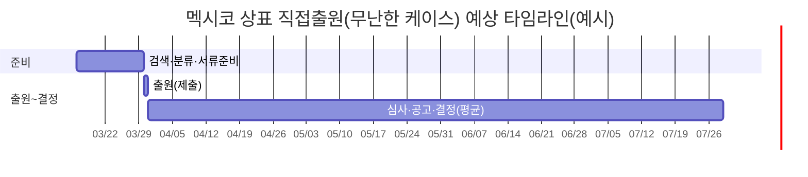
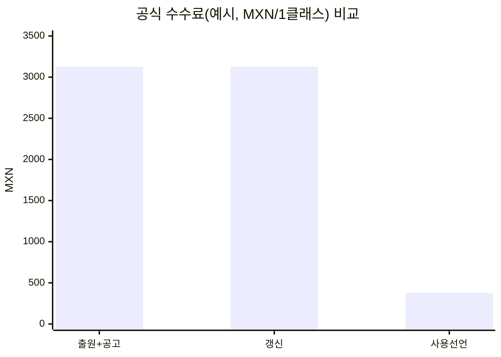

# 한국 기업의 멕시코 상표 보호 실무 가이드북 초안 리서치

## Executive Summary

멕시코에서의 상표 보호는 “등록(출원)–유지(사용·갱신)–집행(침해 대응)”의 **3단계 운영체계**로 접근해야 안정적입니다. 첫째, 멕시코 상표 제도는 행정기관인 IMPI가 **등록 심사·공고(가제타)·행정적 침해절차·임시조치(가처분 성격)·손해배상액 산정까지** 폭넓게 관장하는 구조이며, 다수 절차가 IMPI의 공식 공보인 **가제타(Gaceta de la Propiedad Industrial)**를 통해 공지·통지됩니다. 따라서 한국 본사(또는 현지법인)는 “출원만 하고 끝”이 아니라, **가제타 기반 모니터링·기한 관리 체계**를 사전에 갖추어야 합니다. citeturn3view0turn43view1turn40view3

둘째, 출원 경로는 크게 **멕시코 직접출원**과 **마드리드 국제등록을 통한 멕시코 지정(사후지정 포함)**으로 나뉩니다. 직접출원은 멕시코 국내 절차에 즉시 편입되어 상대적으로 “현지 사안(거절·이의·보정)에 즉응”하기 좋고, 마드리드는 여러 국가를 동시에 관리할 때 효율적입니다. 다만 마드리드의 경우에도 지정국(멕시코)은 자국법에 따라 실체심사를 수행하며, 지정국 거절통지가 없으면 보호가 부여되는 구조(12/18개월 룰 등)를 이해해야 합니다. citeturn20view0turn44view0

셋째, 멕시코는 **출원 공고 이후 ‘이의(오포지션)’ 제도가 작동**하고, 이의 제출이 있으면 출원인이 의견·증거를 제출할 기회가 주어집니다(기본 2개월, 추가 2개월 유예 가능 등). 이 단계에서의 대응 품질이 등록 성패와 이후 분쟁 비용을 좌우합니다. citeturn43view3

넷째, 등록 후 관리에서 가장 자주 발생하는 리스크는 (1) **사용 선언/사용 입증 관련 의무 누락** (2) **갱신 시점 실기** (3) **명칭·주소·양도·라이선스 등 변동의 미기록**입니다. 특히 IMPI는 상표의 존속기간 기산점과 “사용 선언(Declaración de uso)”의 적용 범위를 명확히 안내하고 있으며, 해당 기한을 놓치면 권리가 소멸될 수 있어 **달력(티켓) 기반 자동 알림**이 사실상 필수입니다. citeturn6search24turn5view0

다섯째, 침해 대응은 멕시코에서 **행정(IMPI) 중심**으로 설계할 때 실무 효율이 높습니다. IMPI는 침해를 중지시키기 위한 **임시조치(제품 회수·판매금지·수입·수출 물품의 자유유통 정지, 디지털 차단/삭제 등)**를 명령할 수 있고, 신청인에게는 **보증(피해담보를 위한 보증금·보증보험증권/예치증)** 제공이 요구될 수 있습니다. 즉, 침해 대응은 “법리”뿐 아니라 “보증·증거·물류(세관)·플랫폼”을 포함한 운영 프로젝트입니다. citeturn3view0turn40view1

여섯째, 국경(세관) 측면에서는 멕시코 관세 당국이 불법 상품의 국경 통과를 막는 역할을 하며, 상표권자는 **IMPI 절차(임시조치 등)와 연계**해 수입·수출 단계에서 통제를 설계하는 것이 일반적입니다. citeturn42search12turn3view0

마지막으로, 상표는 단독 권리로만 보지 말고 **도메인(.MX), 디자인(포장·형상), 저작권(로고·패키지 그래픽)**과 결합해 “다층 방어”를 구축해야 합니다. .MX 도메인 분쟁은 WIPO의 .MX 전용 절차(LDRP)를 통해 다툴 수 있으며, 상표뿐 아니라 등록된 슬로건, 원산지 명칭, 권리보유 “예약(Reservation of rights)” 등도 근거 권리가 될 수 있습니다. 로고·카피·콘텐츠는 INDAUTOR 체계의 저작권 등록/계약 기록과도 연결해 운영하는 것이 유리합니다. citeturn42search3turn42search7turn42search2

---

## 분석 보고서

아래 내용은 “책자(가이드북)” 형태로 바로 전환할 수 있도록, **실무 지침 → 단계별 체크리스트 → 제출서류(샘플 목록) → 비용·기간 표** 순으로 각 주제군을 구성했습니다. (예산·업종·제품군은 미지정이므로, **범용 템플릿**과 **공식 수수료 중심**으로 제시합니다. 수임료·번역료·공증료는 케이스별 편차가 커 **‘산정 방법’ 중심**으로 안내합니다.)

### 멕시코 상표법 개요 및 제도 운영 포인트

**핵심 지침(실무 관점)**  
멕시코 상표 제도는 IMPI가 등록·공고·통지·집행까지 관여하는 비중이 크고, 다수의 통지/공지 효력이 **가제타(Gaceta)**를 통해 발생합니다. 즉, “메일·우편만 기다리는 방식”은 위험하며, 출원·등록 포트폴리오의 모든 사건에 대해 “가제타/전자보드 모니터링”을 운영 프로세스로 두어야 합니다. citeturn43view1turn40view3

- 가제타는 IMPI의 공식 공보(공식적 ‘출판 및 통지’ 수단)로 정의되며, 가제타에 실린 행위는 가제타에 표시된 날짜 또는 발행 다음 영업일부터 효력이 발생할 수 있습니다. citeturn43view1  
- IMPI는 권리 침해를 예방·중지하기 위한 임시조치(가처분 성격)를 명하고 집행할 수 있으며, 손해배상액을 산정하고 공권력 지원을 요청하는 권한도 법에 열거됩니다. citeturn40view3turn3view0

> 💡 **실무 팁 박스**  
> “멕시코는 ‘기한(기간) 컴퓨팅’이 운영 리스크의 70%”라고 보는 편이 안전합니다. 가제타 통지·영업일 계산·연장(추가 2개월 등) 규칙을 사내 표준으로 문서화하고, 출원번호 단위로 캘린더 알림을 자동 생성하세요. citeturn43view1turn43view3

**단계별 체크리스트(제도 이해/준비)**  
- (내부) 브랜드/제품군별 “상표 자산 목록(후보명 포함)” 작성  
- (내부) 멕시코 판매/수출/라이선스/온라인 판매 채널(마켓플레이스 포함) 맵핑  
- (외부) 가제타·검색 시스템(MARCia/MARCANET 등) 모니터링 담당 지정 citeturn16view0turn15search11turn12search1  
- (내부) 권리 유지(사용 선언/갱신) 책임자(RACI) 확정 citeturn6search24

**제출서류(샘플 목록)**  
- (사내 준비) 상표 표장(문자/로고 이미지), 사용 예정 상품·서비스 목록(초안)  
- (사내 준비) 출원인(법인) 영문·스페인어 표기, 주소, 대표자 정보(기초 데이터)  
- (대리인 사용 시) 대리권 관련 서류(현지 요구 형식 반영 필요) citeturn15search13

**예상 비용·소요기간(제도 준비)**

| 구분 | 정부 수수료 | 내부 소요 | 리드타임 |
|---|---:|---:|---:|
| 사전 준비(검색·분류·전략) | 기본 무료(툴 활용 시) | 중 | 1~2주(표장·클래스 복잡도에 따라) |

(검색·분류 툴은 IMPI 제공 시스템과 ClasNiza(니스 분류 기반) 등으로 무료로 접근 가능한 범위가 있습니다. citeturn12search12turn15search11turn16view0)

---

### 상표 검색·분류(니스) 및 출원 전 검증

**핵심 지침**  
멕시코는 출원서의 상품·서비스 지정이 곧 리스크입니다. (1) **니스 분류(45개 클래스)**를 기준으로 “필수 클래스”와 “확장 클래스”를 나누고 (2) 표장 유사·동일 검색을 “문자(철자) + 음성(발음) + 로고(도형)” 관점으로 반복 수행한 뒤 (3) 최종 지정상품·서비스 문구를 현지 판매 방식에 맞게 다듬어야 합니다. citeturn12search12turn15search11turn16view0

- ClasNiza는 클래스 목록과 설명을 제공하며(상품/서비스), 실제 지정상품 문구 구성 시 기준점으로 사용됩니다. citeturn12search12  
- IMPI는 MARCia와 MARCANET(외부 정보 서비스)을 통해 등록·출원 중 상표 정보를 조회할 수 있다고 안내합니다. citeturn16view0turn15search11turn12search1

> 💡 **실무 팁 박스**  
> “한 클래스에 너무 넓게 쓰면” 심사·거절 리스크가 늘고, “너무 좁게 쓰면” 향후 사업 확장 시 공백이 생깁니다. 따라서 **코어 제품/서비스(현재)**는 정확히, **확장(미래 2~3년)**은 과도하지 않게 ‘두 층’으로 설계하세요. (클래스 설계는 갱신·사용 선언에서도 영향을 받습니다.) citeturn6search24turn12search12

**단계별 체크리스트(검색·분류)**  
- (분류) 코어/확장 상품·서비스 리스트업 → 클래스 매핑(ClasNiza) citeturn12search12  
- (검색) 문자 동일/유사(띄어쓰기·철자 변형 포함)  
- (검색) 음성 유사(스페인어·영어 발음 기준)  
- (검색) 로고/도형 요소(유사 도형·배치)  
- (판단) 충돌 후보에 대해: (A) 명칭 조정, (B) 지정상품 조정, (C) 공존/동의 전략, (D) 출원 포기 중 선택

**제출서류(샘플 목록)**  
- 검색 결과 캡처/리스트(사내 검토용)  
- 지정상품·서비스 문구(스페인어 최종안 권장)  
- 로고 파일(색상/흑백 버전, 파일 규격은 출원 경로·시스템 요구에 맞춤) citeturn15search11turn15search13

**예상 비용·소요기간(검색·분류)**

| 작업 | 정부 수수료 | 내부/외부 비용 포인트 | 리드타임 |
|---|---:|---|---:|
| 기본 검색·분류 | 무료(툴 활용) | 인력(법무/브랜드/영업) | 1~3영업일 |
| 심층 검색(리스크 검토) | 무료(툴 활용) | 현지 대리인 검토 시 수임료 발생 가능 | 3~7영업일 |

(온라인 절차 안내문도 “분류(Clasifica)–검색(Busca)–출원–결제–서명–추적” 형태로 출원 전 검색을 권고합니다. citeturn15search11)

---

### 상표 출원 절차: 직접출원 vs 마드리드 vs 국제관리 관점 비교

**핵심 지침(경로 선택 프레임)**  
- **직접출원(멕시코 내 권리화 최우선)**: 멕시코 절차(공고·이의·보정)에 즉시 대응하기 쉬움.  
- **마드리드(다국가 동시 확장·관리)**: 국제등록 1건으로 다수 국가 관리(갱신·명칭변경 등 중앙관리) 장점이 있으나, 지정국(멕시코)의 거절·요구사항은 별도로 발생합니다. citeturn20view0turn44view0turn18view0

**비교표(요약)**

| 구분 | 직접출원(멕시코) | 마드리드(멕시코 지정) |
|---|---|---|
| 접수/시스템 | IMPI 전자서비스(예: PASE 기반) 활용 | 본국관청 경유 후 WIPO 국제사무국 절차 + 멕시코 지정국 심사 |
| 언어 | 실무상 스페인어 중심 운영 | 국제출원 언어(영/불/서) + 지정국 단계 현지 대응 citeturn20view0turn44view0 |
| 수수료 구조 | 멕시코 정부 수수료(페소) 중심 | WIPO 기본수수료 + 지정국 개별수수료(멕시코는 클래스당 개별수수료) citeturn18view0turn44view0 |
| 일정 관리 | IMPI·가제타 중심 | WIPO(국제등록·갱신) + 멕시코 내 심사·사용 의무 병행 |
| 추천 상황 | 멕시코가 핵심시장/현지 분쟁 가능성 높음 | 여러 국가 동시 진출·사후지정 계획/중앙관리 필요 |

**직접출원(기본 흐름, ‘마카 엔 리네아’ 기반)**  
멕시코 온라인 안내는 (1) 계정 생성(PASE) → (2) 분류(ClasNiza) → (3) 검색(MARCia 등) → (4) 출원서 작성 → (5) 결제 → (6) 서명·제출 → (7) 전자보드/가제타로 추적 형태로 제시됩니다. citeturn15search11turn15search13turn12search0

**마드리드(기본 개요: 기초권리·기한·우선권)**  
- 마드리드 국제출원은 본국관청을 통해서만 제출하며, 국제등록 후 지정국은 자국법에 따라 심사하고, 거절통지를 일정기간 내 통지해야 합니다. citeturn20view0turn44view0  
- 우선권은 파리협약 기반으로 6개월 범위에서 주장 가능하며, WIPO 국제사무국은 “국제등록일 기준 6개월보다 앞선 우선일”은 무시할 수 있음을 명시합니다. 또한 국제사무국은 우선권 서류 사본을 요구하지 않는다고 안내합니다(지정국은 별도 요구 가능). citeturn45view0turn44view0  
- 멕시코 지정 시 WIPO 개별수수료는 “클래스당 CHF 132”로 공시되어 있습니다(2026-01-01 업데이트 기준). citeturn18view0

> 💡 **실무 팁 박스**  
> “마드리드로 멕시코를 지정해도, 멕시코의 **사용 선언·갱신·가제타 기반 통지**는 그대로 따라옵니다.” 즉, 마드리드는 ‘출원·갱신의 중앙화’이지 ‘현지의무 소멸’이 아닙니다. citeturn6search24turn43view1turn44view0

**단계별 체크리스트(경로 선택)**  
- (전략) 멕시코가 핵심시장인가? (예: 매출·OEM/ODM·유통채널·위조 리스크)  
- (범위) 멕시코 외 지정국 수(3개국 이상이면 마드리드 효율 상승 가능) citeturn20view0turn44view0  
- (일정) 출시/수출 일정 vs 등록 필요성(라이선스 계약·유통계약 조건)  
- (운영) 사용 선언/갱신·변경을 누가 관리할지(본사/현지법인/대리인) citeturn6search24

**제출서류(샘플 목록: 직접출원)**  
공식 안내(중소기업 원스톱 가이드)는 온라인 출원 시 대표적으로 다음을 요구합니다. citeturn15search13  
- PASE 계정(등록)  
- “Solicitud de signos distintivos A o B”(시스템 내 서식)  
- “Hoja adicional complementaria”(인적사항 보완 서식)  
- 수수료 납부 증빙(Comprobante de pago)  
- 대리권을 증명하는 문서(Documento que acredita la personalidad del mandatario)  
- IMPI “Registro General de Poderes” 등록 관련 증빙(해당되는 경우)

**예상 비용·소요기간(출원 경로별: 공식 수수료 중심)**

| 구분 | IMPI/WIPO 공식 수수료(예시, 1클래스) | 대표 추가 비용 항목 | 평균 리드타임(변동 큼) |
|---|---:|---|---:|
| 멕시코 직접출원 | 출원+공고(클래스당) MXN 3,126.89 citeturn5view0 | 번역·현지대응·거절/이의 대응 | 안내자료 기준 4~6개월(무난한 케이스) citeturn15search11 |
| 마드리드(멕시코 지정) | 멕시코 개별수수료 CHF 132/클래스(+기본수수료 등) citeturn18view0turn44view0 | 국제출원 수수료·대리인·지정국 대응 | 지정국 거절통지 기한(12/18개월 구조) 이해 필요 citeturn20view0turn44view0 |

---

### 심사·공고·이의신청·거절 대응(핵심 기한 중심)

**핵심 지침(한 줄 요약)**  
멕시코 상표 실무의 승부처는 “공고 후 1개월(이의) + 출원인 대응 2개월(연장 가능)” 구간입니다. 이때 **(1) 유사/동일 판단 논리 (2) 사용·명성 증거 (3) 지정상품 축소/조정 전략**을 동시에 운용합니다. citeturn43view3turn43view1

**법정/공식 일정(발췌 가능한 범위)**  
- IMPI는 “1개월의 기간(법 제221조에서 정한 기간)이 끝나면” 본격 심사를 진행합니다. citeturn43view3  
- 요건 미비·거절 장애(impedimento) 또는 이의(oposición)가 있으면 출원인에게 통지하며, 출원인은 **2개월** 내 의견·증거 제출 기회가 주어집니다. 기간 내 답변이 없으면 출원은 **포기(abandono)**로 간주될 수 있습니다. citeturn43view3  
- 추가로 **2개월**의 보완 기간이 존재하되(수수료 납부 필요), 이를 놓치면 역시 포기될 수 있습니다. citeturn43view3turn5view0  
- 2개월 구간 이후에는 출원인과 이의 제출자가 **5일** 내 최종 의견(alegatos)을 낼 수 있고, 이후 IMPI가 결정을 내리는 절차가 규정되어 있습니다. citeturn43view3  
- 이의 제기 자체는 심사 결과를 미리 결정하지 않는다고 명시됩니다(“oposición… no prejuzgará…”). 즉, **‘이의 이겼다=자동 등록 거절’**도 아니고, **‘이의 패했다=자동 등록’**도 아닙니다. citeturn43view3

**단계별 체크리스트(오피스 액션/이의/거절 대응)**  
- (D0) 통지 확인: 가제타/전자보드에서 오피스 액션·이의 접수 여부 확인 citeturn43view1turn15search11  
- (D1~D10) 리스크 분류: (a) 방식 보정 (b) 절대적 거절 (c) 상대적 거절(선등록) (d) 악의/혼동 주장 등  
- (D1~D30) 증거 패키지 구성:  
  - 사용 증거(판매, 인보이스, 카탈로그, 웹사이트 스냅샷, 수출입 서류 등)  
  - 혼동 부재 논리(표장 차이, 거래자/수요자, 유통 채널 구분)  
  - 지정상품 축소/정리(정면충돌 회피)  
- (D30~D55) 대응서(스페인어) 작성·검토·제출  
- (D55~D60) 제출 후 “증빙(접수증/수수료)” 보관, 후속 기한(5일 의견서 등) 재설정 citeturn43view3turn5view0

**제출서류(샘플 목록: 이의/거절 대응 시)**  
- 의견서(Respuesta/Escrito)  
- 증거자료(서류·스크린샷·거래증빙 등)  
- (필요 시) 지정상품 축소/정정 신청 관련 서류  
- (기한 연장 활용 시) 추가 기간 수수료 납부 증빙 citeturn43view3turn5view0

**예상 비용·소요기간(이의/거절 대응)**

| 절차 | 공식 수수료(대표) | 리드타임(법정/운영) | 비고 |
|---|---:|---:|---|
| 이의 제기 | MXN 415.91 citeturn5view0 | 공고 후 1개월 창구(제221조 기간 종료 언급) citeturn43view3 | 성패와 무관하게 심사에는 영향(자료로 반영) |
| 출원인 답변 | (연장 시) 추가기간 수수료 존재 citeturn43view3turn5view0 | 기본 2개월 + 추가 2개월(유료) citeturn43view3 | 미응답 시 포기 간주 가능 |

---

### 등록·갱신·변경·양도·라이선스(권리 유지 운영)

**핵심 지침**  
멕시코에서는 “등록=끝”이 아니라, (1) **존속기간 기산점 확인** (2) **사용 선언 기한 관리** (3) **갱신 시 사용 선언 포함 여부 확인** (4) 변동(명칭·주소·양도·라이선스) 기록을 통해 “권리 상태를 깨끗하게 유지”하는 것이 분쟁비용을 크게 줄입니다. citeturn6search24turn5view0

**존속기간(기산점 주의)**  
IMPI 공식 안내에 따르면, 상표는 원칙적으로 10년 단위로 존속하되, 제도 변경에 따라 **(i) 2020-11-05 이전 등록은 ‘출원일’ 기준 10년, (ii) 2020-11-05 이후 출원은 ‘등록일(부여일)’ 기준 10년**으로 안내됩니다. 동일 포트폴리오 내에서도 기산점이 다를 수 있으므로, 사건마다 “만료일”을 시스템에 이중 입력(원천일자/만료일)하는 방식이 안전합니다. citeturn6search24

**사용 선언(Declaración de uso) – 핵심 리스크**  
IMPI는 사용 선언 의무의 적용 범위와 기한을 구체적으로 안내합니다(예: 특정 시점 이후 등록된 상표에 대해 3년 경과 후 일정 기간 내 제출, 갱신 시에도 사용 선언 포함 등). 사용 선언 누락은 권리 소멸 리스크가 될 수 있으므로 “등록 직후부터 3년 타이머”를 가동하는 방식으로 운영해야 합니다. citeturn6search24turn5view0

> 💡 **실무 팁 박스**  
> 사용 선언을 준비할 때는 “멕시코 내 실제 사용”을 입증할 자료를 **3년차가 아니라 1년차부터** 누적 저장하세요. 판매 인보이스·유통계약·온라인 판매 화면·포장 사진(멕시코 유통 표시)처럼 ‘시간 스탬프’가 남는 증거가 핵심입니다. (사용 선언 제도 안내에 따라 증거 준비 부담이 달라질 수 있습니다.) citeturn6search24

**변경·양도·라이선스(기록 전략)**  
IMPI 안내는 (1) 상표권 이전(양도) (2) 라이선스/프랜차이즈의 기록 가능성 (3) 일정 변경은 권리 유지·대항력 측면에서 중요함을 전제로 관련 절차를 제시합니다. 특히 멕시코는 상표권 변동이 실제 비즈니스(유통, 라이선스, 제조위탁)와 직결되는 경우가 많아, 계약 체결만으로 끝내지 말고 “기록 필요성”을 체크리스트화해야 합니다. citeturn6search24turn5view0

**단계별 체크리스트(등록 후 운영)**  
- 등록 직후  
  - (필수) 만료일/갱신창구(만료 6개월 전) 캘린더 등록 citeturn6search24  
  - (필수) 3년 사용 선언 알림 설정(“등록일 기준”으로 타이머) citeturn6search24  
- 갱신 국면  
  - (필수) 갱신 수수료 납부 + (필요 시) 사용 선언 동시 제출 여부 확인 citeturn6search24turn5view0  
- 조직/거래 변동  
  - (M&A/조직개편) 권리자 명칭·주소 변경 기록 필요성 검토  
  - (라이선스) 라이선서/라이선시가 침해 대응(세관 포함)을 해야 하는 구조라면 **기록(등록) 요건**을 사전 점검 citeturn6search24turn5view0  

**제출서류(샘플 목록: 갱신/사용 선언/변경)**  
- 갱신 신청서 + 수수료 납부 증빙 citeturn5view0turn6search24  
- 사용 선언서 + 수수료 납부 증빙(클래스별) citeturn5view0turn6search24  
- 변경/양도/라이선스 기록 신청서 + 계약서(요약/사본/공증 등은 사건 요건에 따라) citeturn6search24turn5view0  

**예상 비용·소요기간(등록 후 운영: 공식 수수료)**

| 절차 | 공식 수수료(대표) | 실무 리드타임 | 비고 |
|---|---:|---:|---|
| 갱신(클래스당) | MXN 3,126.89 citeturn5view0 | 만료 전 준비 권장 | 기산점(출원일/등록일) 혼재 주의 citeturn6search24 |
| 사용 선언(클래스당) | MXN 376.66 citeturn5view0 | 증거 수집이 핵심(1~4주) | 의무 적용 범위·기한 IMPI 안내 준수 citeturn6search24 |
| 변경/기록(일부) | 절차별 수수료 상이(법정표 존재) citeturn5view0 | 1~4주(서류 준비에 좌우) | 계약서/권한증명 준비가 변수 |

---

### 침해 대응(행정·민사·형사), 관세·세관 조치, 디지털·타 권리와의 결합

#### 행정 중심(IMPI) 침해 대응 프레임

**핵심 지침**  
멕시코에서는 IMPI가 임시조치 및 행정적 침해절차를 통해 “유통 차단–증거 확보–손해 산정”을 연결할 수 있으므로, 실무는 다음 3축으로 설계합니다:  
(1) **증거(진품·침해품·거래흐름)** (2) **임시조치(오프라인+국경+온라인)** (3) **보증(신청인 보증·상대방 반대보증)** citeturn40view3turn3view0turn40view1

**임시조치(대표 유형)**  
법 조문은 임시조치의 형태로 예컨대 (i) 침해행위 중지 명령 (ii) 상품 회수·판매 중지 (iii) 물품 압수/확보 (iv) 수입·수출 등 국경에서의 물품 자유유통 정지 (v) 디지털 환경에서의 중지·차단·삭제 등을 열거합니다. 온라인 위조·플랫폼 침해까지 포함해 “오프라인+온라인+국경”의 단일 패키지로 설계할 수 있다는 점이 운영상 강점입니다. citeturn3view0turn42search26turn42search29

**보증(피해담보) – 비용·리스크의 핵심**  
임시조치 신청 시 IMPI는 신청인에게 (a) 권리자임 및 침해/임박/회복불능 위험 등 요건 소명 (b) 상대방 피해에 대비한 **보증금 또는 예치증(“fianza o billete de depósito”)** 제공 (c) 침해 물품/플랫폼 식별정보 제공 등을 요구할 수 있습니다. 상대방은 반대보증(contrafianza)을 통해 임시조치 해제를 구할 수도 있습니다. 즉, 침해 대응 예산에는 “소송비”뿐 아니라 “보증(담보) 여력”이 반드시 포함되어야 합니다. citeturn40view1turn40view3

**단계별 체크리스트(침해 대응: 행정 중심)**  
- 탐지(Detect)  
  - 위조·무단사용 채널 분류: 오프라인 유통 / 수입·수출 / 온라인몰·SNS / 도메인  
  - 증거 고정: 구매(테스트바이)·사진·페이지 캡처·물류 서류 확보  
- 차단(Stop)  
  - 임시조치 패키지 구성(오프라인+국경+디지털) citeturn3view0turn42search26  
  - 보증(담보) 계획 수립(금액 산정 자료 준비 포함) citeturn40view1  
- 확정(Resolve)  
  - 행정적 침해절차 본안 진행(기한 내 본안 제기 요건 존재) citeturn40view1  
  - 손해 산정/합의/재발방지(모니터링)로 연결

**제출서류(샘플 목록: 임시조치/행정 절차)**  
- 권리 증빙(등록증/권리 범위)  
- 침해 소명 자료(상품·포장·스크린샷·거래)  
- 임시조치 신청서(조치 대상·장소·플랫폼 식별정보 포함) citeturn40view1turn3view0  
- 보증금/예치증 관련 증빙(금액 산정 근거 포함) citeturn40view1  

**예상 비용·소요기간(침해 대응·임시조치)**

| 절차 | 공식 수수료 | 핵심 비용 변수 | 예상 소요 |
|---|---:|---|---:|
| 임시조치 신청 | 사건 성격별 상이 | **보증(담보) 규모**, 증거 수집·현장집행 | 긴급(수일~수주) |
| 본안(행정 침해) | 절차별 상이 | 증거·감정·대리인 비용 | 수개월~ |

(임시조치에 보증이 요구될 수 있다는 점, 반대보증 가능성, 본안 제기 기한 요건 등은 법 조문에 직접 규정됩니다. citeturn40view1)

#### 관세·세관(국경) 조치

**핵심 지침**  
세관 조치는 “세관 단독”이 아니라, 통상 **IMPI의 임시조치/결정과 연계**해 실효성을 확보합니다. 멕시코 법은 임시조치 중 하나로 수입·수출 등 국경 단계에서의 물품 자유유통을 정지시키는 유형을 포함하고 있으며, 미국 상무부의 국가 상업 가이드는 멕시코 국가 관세 기관이 불법 상품의 국경 통과를 막는 역할을 수행한다고 안내합니다. citeturn3view0turn42search12

> 💡 **실무 팁 박스**  
> “멕시코 국경 조치”는 (1) 제품 식별(진품·가품 포인트) (2) 공급망 정보(수입자·운송경로) (3) IMPI 절차(임시조치) (4) 담보(보증)까지 포함한 **패키지 문서**가 있어야 속도가 나옵니다. citeturn3view0turn40view1

#### 도메인(.MX)·디자인·저작권과의 관계

**도메인(.MX)**  
WIPO는 .MX 국가도메인에 대해 전용 도메인 분쟁해결 서비스(LDRP)를 제공하며, UDRP가 상표권 중심인 것과 달리 LDRP에서는 등록상표/서비스표 외에도 등록된 슬로건(“aviso comercial”), 원산지명칭, 특정 권리 “예약” 등도 근거 권리로 삼을 수 있다고 설명합니다. 이는 “상표 등록이 아직 없거나, 슬로건·권리예약이 더 강한” 케이스에서 유용할 수 있습니다. citeturn42search3turn42search7

- 한국 기업 관련 사례(도메인): **entity["company","Samsung Electronics Co., Ltd","electronics company"]**은 .MX 도메인 분쟁에서 `samsungmobile.com.mx`에 대해 이전(transfer) 결정을 받은 사례가 WIPO 사건 요약에 확인됩니다(사건번호 DMX2006-0004, 2006-07-11 결정). citeturn37view0

**저작권(로고·패키지 그래픽·콘텐츠)**  
로고·패키지 그래픽·매뉴얼·광고물 등은 상표와 별개로 저작권 레이어를 쌓을 수 있고, 멕시코의 저작권 행정은 **entity["organization","INDAUTOR","mexico copyright office"]**(Instituto Nacional del Derecho de Autor) 체계를 통해 작품 등록 및 라이선스·양도 계약 기록 등을 지원합니다. IP 분쟁에서는 “상표(출처표지) + 저작권(표현)”을 함께 주장할 수 있어 협상력이 올라가는 경우가 많습니다. citeturn42search2turn42search6turn42search14

**디자인(형상·포장)과 상표(3D) 결합**  
멕시코 법 체계는 산업재산 영역(상표·디자인 등)에서 등록·공고·무효/취소 절차가 가제타와 연결되며, 형상(포장) 요소는 “디자인 등록” 또는 “3차원 상표” 등의 다층 전략으로 설계할 여지가 있습니다. (개별 제품군별 최적 조합은 별도 케이스 분석이 필요합니다.) citeturn43view1turn3view0

---

### 시각자료: 절차 흐름도·비교·비용/기간 그래프

```mermaid
flowchart TD
  A[사전 준비: 분류(니스)·검색·표장 확정] --> B[출원서 작성/제출 (온라인)]
  B --> C[공고(가제타)]
  C --> D{이의 제기(1개월 창구)}
  D -- 없음 --> E[실체심사/요건심사]
  D -- 있음 --> F[출원인 통지]
  F --> G[출원인 답변 2개월]
  G --> H{추가 2개월(유료) 필요?}
  H -- 아니오 --> I[증거·서면 정리]
  H -- 예 --> J[추가 답변/보완]
  I --> K[최종 의견(5일)]
  J --> K
  K --> L[결정: 등록 또는 거절]
  L --> M[등록 후: 사용 선언/갱신/변경 관리]
```

위 흐름에서 “이의 1개월, 출원인 답변 2개월(+추가 2개월), 최종 의견 5일” 등 핵심 기한은 멕시코 법 조문에 근거합니다. citeturn43view3turn5view0



온라인 안내자료는 “Plazo de respuesta 4–6 meses(4~6개월)” 수준의 처리기간 예시를 제공합니다(개별 사건에 따라 연장 가능). citeturn15search11



막대그래프의 금액은 멕시코 “Ley Federal de Derechos”에 따른 IMPI 관련 수수료(예시: 출원+공고, 갱신, 사용 선언)에서 발췌한 값입니다. citeturn5view0

---

## 책자 구성안

아래는 “책자용 목차”와 각 장 요약(각 1~2문단)입니다. (실제 책자 제작 시, 각 장 끝에 ‘템플릿/체크리스트’ 부록을 붙이는 구조를 권장합니다.)

**목차(안)**  
- 서문: 멕시코 상표 리스크 맵(한국 기업 관점)  
- 멕시코 상표 제도 개요와 IMPI 운영 구조  
- 상표 전략 수립: 표장·클래스·상품/서비스 스코프 설계  
- 검색과 분류(니스): MARCia/MARCANET/ClasNiza 활용  
- 출원 경로 선택: 직접출원 vs 마드리드(국제출원) 비교  
- 출원서 작성 실무: 제출서류·권한·전자출원(PASE)  
- 공고·이의·거절 대응 플레이북  
- 등록 후 의무: 사용 선언·갱신·권리 유지 캘린더  
- 변경·양도·라이선스·프랜차이즈: 거래 구조별 체크포인트  
- 침해 대응(행정 중심): 임시조치·보증·증거·손해  
- 관세·세관(국경) 조치와 물류 통제  
- 도메인(.MX)·디자인·저작권(인다우토르)과의 결합 전략  
- 분쟁 예방: 포트폴리오 관리·모니터링·내부통제(RACI)  
- 실무 사례/판례 요약(한국 기업 사례 우선)  
- 부록: 체크리스트·서식 템플릿·타임라인·FAQ·공식 링크

**각 장 요약**

**멕시코 상표 제도 개요와 운영 구조**  
이 장은 가제타를 중심으로 한 IMPI 통지/공고 체계와, IMPI가 임시조치·손해 산정 등 집행 기능까지 수행하는 제도적 특징을 설명합니다. 가제타 모니터링이 왜 “법무가 아니라 운영”인지, 무엇을 언제 확인해야 하는지(통지 효력·영업일 계산 포함)를 제시합니다. citeturn43view1turn40view3

**전략 수립: 표장·클래스·스코프 설계**  
표장(브랜드명/로고/슬로건) 후보를 어떻게 정리하고, 니스 분류(45 클래스) 기반으로 “코어/확장” 스코프를 나누는지 안내합니다. 특히 멕시코 사업모델(수출·현지 제조·유통·라이선스)의 차이가 어떤 클래스/권리 유지(사용 선언)에 영향을 주는지 연결합니다. citeturn12search12turn6search24

**검색과 분류: 툴 활용 실무**  
ClasNiza(클래스 정의), MARCia(빠른 유사 검색), MARCANET(등록/출원 정보 조회) 등 IMPI 생태계를 “검증 흐름”으로 묶어 설명합니다. 검색 결과를 법무 검토 자료로 표준화(캡처 규칙·로그 규칙)하는 방법과, 유사표장 발견 시 의사결정 트리(명칭 수정/스코프 수정/공존 전략)를 제공합니다. citeturn12search12turn16view0turn12search1

**출원 경로 선택과 출원서 작성**  
직접출원(멕시코)과 마드리드(멕시코 지정)의 장단점, 비용 구조(페소 vs CHF 개별수수료), 운영 기한(지정국 심사·우선권 6개월) 등을 비교합니다. 또한 PASE 기반 전자출원에서 요구되는 대표 서류(A/B 신청서, 권한증명, 납부증빙 등)를 체크리스트로 정리합니다. citeturn15search13turn18view0turn45view0turn20view0

**공고·이의·거절 대응 플레이북**  
공고 후 1개월 이의 창구, 이의 발생 시 출원인의 2개월 답변(+추가 2개월) 구조, 5일 의견서 등 핵심 기한을 중심으로 “오피스 액션 대응 패키지(논리+증거+스코프 조정)”를 설명합니다. 미응답 시 포기 간주 리스크와, 추가 기간(유료) 활용 기준을 운영 관점에서 제시합니다. citeturn43view3turn5view0

**등록 후 의무와 거래(갱신·변경·양도·라이선스)**  
등록의 존속기간 기산점(출원일/등록일 혼재 가능)과 사용 선언/갱신 의무를 “캘린더 운영”으로 전환하는 방법을 안내합니다. 또한 양도·라이선스·프랜차이즈 등 거래 구조에서 권리 기록이 왜 중요한지, 어떤 문서 세트가 필요한지 샘플 목록을 제공합니다. citeturn6search24turn5view0

**침해 대응·세관·디지털·도메인·저작권 결합**  
IMPI 임시조치(오프라인·국경·디지털)와 보증(담보) 요건, 반대보증 구조를 실무 액션 플랜으로 정리합니다. 세관은 ANAM 등 국경 기관의 역할과 IMPI 절차 연계를 설명하고, .MX 도메인 분쟁은 WIPO LDRP의 특징(상표 외 권리도 근거 가능)을 요약합니다. 로고·콘텐츠는 INDAUTOR 체계로 저작권 레이어를 결합하는 전략을 다룹니다. citeturn40view1turn3view0turn42search12turn42search3turn42search2

**사례/판례 요약**  
한국 기업이 실제로 .MX 도메인 분쟁에서 이전 결정을 받은 사건(DMX2006-0004)을 소개하고, “상표+일반어 결합 도메인”이 혼동을 피하기 어렵다는 전형적 포인트를 정리합니다. (추가로 멕시코 내 상표 무효/취소·세관조치 등 “케이스 기반” 확장이 필요하면, 제품군·분쟁 유형을 지정해 별도 리서치로 보강하는 구성이 가능합니다.) citeturn37view0turn33search3

---

## 체크리스트와 템플릿

아래 표는 요청하신 “출원 단계별 필수서류·담당자·예상기간·비용” 칼럼을 포함해, 그대로 책자 부록 템플릿으로 전환할 수 있게 구성했습니다.

### 출원 준비 템플릿

| 단계 | 목적 | 필수 서류(샘플) | 담당자(RACI 예시) | 예상기간 | 공식 비용 |
|---|---|---|---|---:|---:|
| 표장 확정 | 보호대상 확정 | 표장(문자/로고), 변형안 리스트 | 브랜드(책임) / 법무(검토) | 3~10일 | 0 |
| 분류(니스) | 클래스·스코프 확정 | 상품/서비스 리스트, 클래스 매핑표 | 법무(책임) / 영업(협조) | 1~3일 | 0 citeturn12search12 |
| 검색 | 유사/동일 리스크 점검 | 검색 로그(캡처), 충돌 후보 리스트 | 법무(책임) / 대리인(선택) | 1~7일 | 0 citeturn16view0turn15search11 |
| 경로 선택 | 직접 vs 마드리드 결정 | 비교 메모(국가/예산/일정) | 법무(책임) / 사업부(승인) | 1~3일 | 0 citeturn18view0turn20view0 |

### 멕시코 직접출원 제출서류 체크리스트(샘플)

| 단계 | 목적 | 필수 서류(샘플 목록) | 담당자 | 예상기간 | 공식 비용 |
|---|---|---|---|---:|---:|
| PASE 계정/접속 | 전자출원 기반 마련 | 계정정보, 인증수단(시스템 요구) | 현지법인/대리인 | 10분~1일 | 0 citeturn15search13turn12search0 |
| 출원서 작성 | 신청 데이터 확정 | A/B 신청서, 인적사항 보완서, 표장 이미지, 지정상품·서비스 | 대리인(책임) / 본사(검토) | 1~5일 | - |
| 수수료 납부 | 접수 요건 충족 | 납부증빙(Comprobante) | 재무(책임) | 1일 | MXN 3,126.89/클래스(출원+공고) citeturn5view0 |
| 권한/대리 | 대리 행위 정당화 | 대리권 증명, (해당 시) Registro General de Poderes 관련 | 대리인(책임) | 1~10일 | 케이스별 citeturn15search13turn5view0 |
| 추적/통지 | 기한 관리 | 전자보드/가제타 모니터링 로그 | 법무(책임) | 상시 | 0 citeturn43view1turn15search11 |

### 마드리드(멕시코 지정) 템플릿

| 단계 | 목적 | 필수 서류(샘플) | 담당자 | 예상기간 | 공식 비용 |
|---|---|---|---|---:|---:|
| 기초권리 확보 | 마드리드 요건 | 한국 기초출원/등록 정보 | 본사 법무 | 2~8주 | 국내 수수료 별도 citeturn20view0 |
| 우선권 주장(선택) | 조기일 확보 | 우선권 정보(관청·출원일·번호) | 본사 법무/대리인 | 1~3일 | - citeturn45view0 |
| 국제출원 제출 | WIPO 절차 개시 | 국제출원서(MM2 등), 상품·서비스 목록 | 본사 법무/대리인 | 1~2주 | WIPO 수수료(기본+지정) citeturn44view0 |
| 멕시코 지정 | 멕시코 보호 요청 | 지정국: Mexico | 본사 법무 | 즉시 | CHF 132/클래스(멕시코 개별수수료) citeturn18view0 |
| 지정국 심사 대응 | 거절/요구 대응 | 멕시코 요구에 대한 스페인어 대응서·증거 | 현지 대리인 | 발생 시 | 케이스별 citeturn20view0turn43view3 |

### 대응 시나리오별 액션 플랜(요약 템플릿)

| 시나리오 | 즉시(48시간) | 단기(2주) | 중기(3개월) | 핵심 비용 변수 |
|---|---|---|---|---|
| 이의 제기 받음 | 기한 도달일 확정(2개월) citeturn43view3 | 답변서+증거 패키지 제출 | 결과에 따라 항목 최적화 | 번역·대리인·추가기간 수수료 citeturn5view0 |
| 거절/요건 보정 | 요구 유형 분류(방식/실체) citeturn43view3 | 보정/의견서 제출 | 필요 시 재출원(새 수수료) | 재출원 수수료(신규) citeturn43view3turn5view0 |
| 위조/침해(오프라인) | 증거 고정·유통경로 파악 | IMPI 임시조치 검토(보증 포함) citeturn40view1 | 본안+손해/합의 | **보증(담보)**, 현장집행 |
| 침해(온라인/플랫폼) | URL·계정 증거 고정 | 디지털 중지/차단/삭제 임시조치 검토 citeturn42search29turn3view0 | 반복 침해 모니터링 | 증거·대응속도 |
| .MX 도메인 분쟁 | WHOIS/사용 증거 확보 | WIPO LDRP 제기 검토 citeturn42search3turn42search7 | 이전/말소 결정 집행 | 절차비용(기관/대리인) |

---

## 공식 출처 링크

요청하신 “우선 참조 출처 우선순위”에 맞춰, **공식·권위 출처**를 먼저 배치했습니다. (링크는 코드 블록으로 제공)

```text
[멕시코 법령/원문]
- Ley Federal de Protección a la Propiedad Industrial (LFPPI, Cámara de Diputados PDF):
  https://www.diputados.gob.mx/LeyesBiblio/pdf/LFPPI.pdf

- (수수료) Ley Federal de Derechos – IMPI 관련 수수료( WIPO Lex 정리 텍스트 ):
  https://www.wipo.int/wipolex/en/text/580210

- (절차 기한 참고) “Plazos de Respuesta a los Trámites” (WIPO Lex):
  https://www.wipo.int/wipolex/en/legislation/details/20219

[IMPI(멕시코 산업재산청) 공식]
- IMPI 전자서비스(Portal de Acceso a Servicios Electrónicos / PASE):
  https://eservicios.impi.gob.mx/

- ClasNiza(니스 분류 기반 클래스 조회, IMPI):
  https://clasniza.impi.gob.mx/clases

- MARCia(상표 검색, IMPI):
  https://marcia.impi.gob.mx/marcas/search/quick

- IMPI 투명성 페이지(가제타/마르카넷 등 안내):
  https://transparencia.impi.gob.mx/paginas/transparencia-focalizada.aspx

- (등록 후 유지/사용선언/갱신 안내 PDF, IMPI):
  https://www.impi.gob.mx/cloud/docs/vigenciayconservacion/renovacion_declaracion_uso_marcas.pdf

[WIPO(마드리드/도메인)]
- Madrid Protocol 지정국 개별수수료(멕시코 포함, 2026-01-01 업데이트):
  https://www.wipo.int/en/web/madrid-system/fees/ind_taxes

- Guide to the Madrid System (WIPO Publication 455, 2024):
  https://www.wipo.int/edocs/pubdocs/en/wipo-pub-455-2024-en-guide-to-the-madrid-system-international-registration-of-marks-under-the-madrid-protocol.pdf

- WIPO .MX 도메인 분쟁해결(LDRP) 안내:
  https://www.wipo.int/en/web/amc/domain-name-disputes/cctld/mx/index

- WIPO .MX 분쟁 절차 Quick Guide(PDF):
  https://www.wipo.int/documents/d/amc/docs-en-cctld_mx.pdf

[한국 특허청(KIPO)]
- 마드리드 국제상표제도 안내:
  https://www.kipo.go.kr/ko/kpoContentView.do?menuCd=SCD0200245

[한국 기업 지원(참고)]
- (멕시코 중소기업 원스톱 안내: 등록 절차/요구서류/예시 비용)
  https://ventanillamipymes.economia.gob.mx/obtencion-de-registro-de-marca-ante-el-impi/
- (온라인 등록 절차 PDF: Marca en línea, 4~6개월 예시 등)
  https://ventanillaunica.economia.gob.mx/media/Marca%20en%20l%C3%ADnea.pdf

[저작권(멕시코)]
- INDAUTOR(Instituto Nacional del Derecho de Autor) 공식:
  https://www.indautor.gob.mx/
- INDAUTOR 온라인 트라미테:
  https://tramitesindautor.cultura.gob.mx/

[관세/세관(공식 참고)]
- U.S. Department of Commerce / trade.gov: Mexico – Protecting Intellectual Property (ANAM 역할 언급, 2026-02-17 갱신):
  https://www.trade.gov/country-commercial-guides/mexico-protecting-intellectual-property
```

각 링크는 본문에서 해당 항목의 근거로 인용된 자료(법령·수수료표·절차안내·국제출원 가이드·도메인 절차·저작권 기관 등)와 직접 연결됩니다. citeturn3view0turn5view0turn18view0turn44view0turn42search3turn42search2turn42search12turn20view0